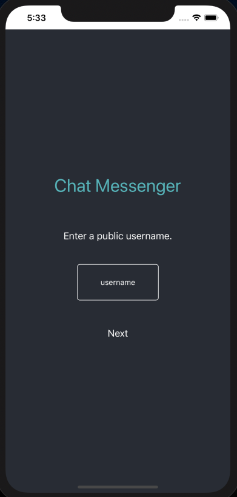
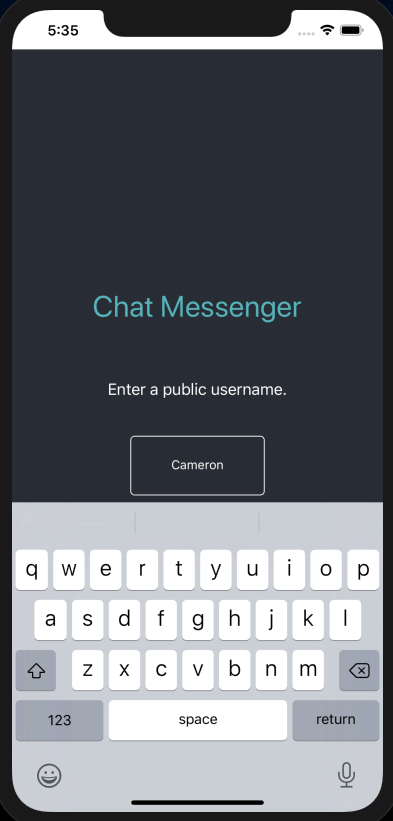
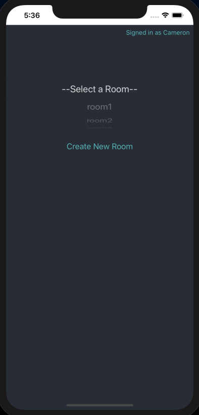
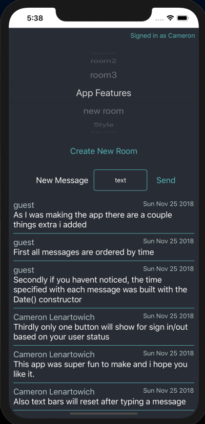
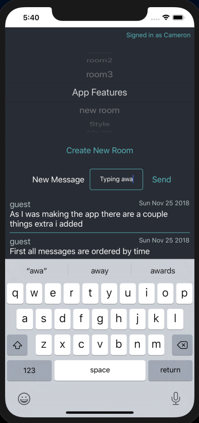
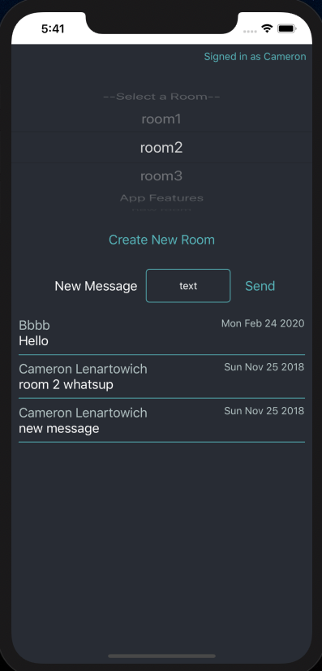

# IOS Chat Messenger

## Tools used:
- React Native
- Google Firebase
- Expo

## How to install
1. Clone this repository into an empty folder on your computer.
2. cd into the project
3. run npm i
4. run npm start. When the prompt asks you how to open the application press "i"
5. A localhost tab should be open in your browser containing expo information. Click "Run on ios simulator" in the bottom left corner of the page.

### The original React web app is available here: https://bloc-chat-messenger-dd4f6.firebaseapp.com/
### This project was built in 2 days.